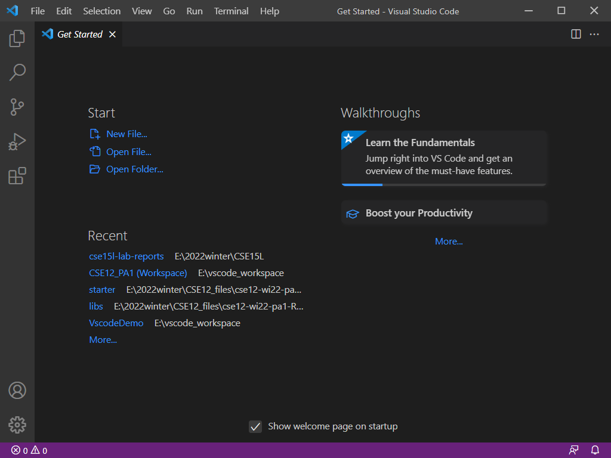
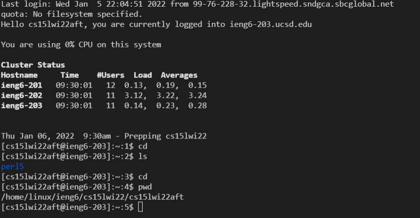
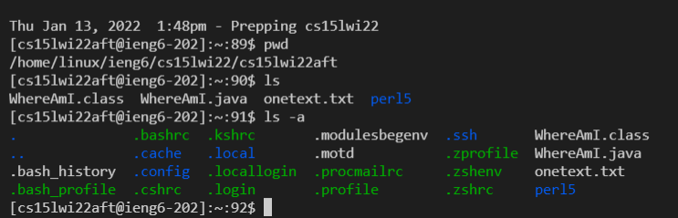
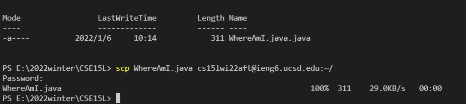
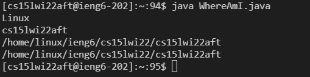
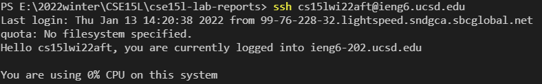
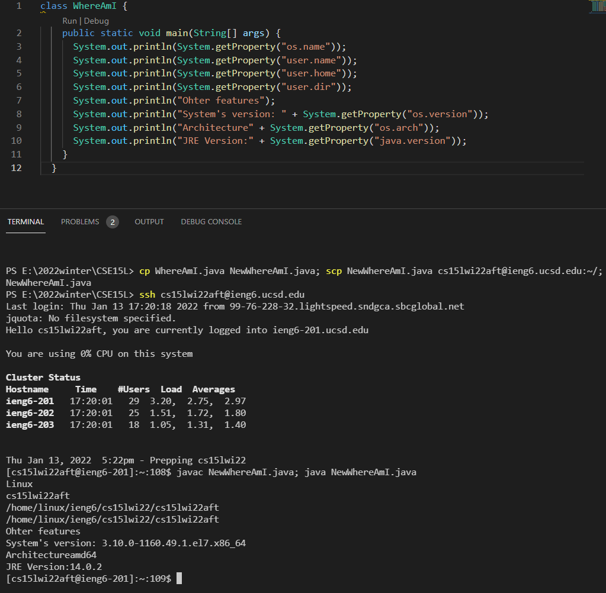

# Lab 1: Remote Access to ieng6

## Task 1: Install VSCode

Go to Visual Studio Code [website](https://code.visualstudio.com/) to download it.

>Visual Studio Code combines the simplicity of a source code editor with powerful developer tooling, like IntelliSense code completion and debugging.

It also has a good user interface that allows us to interact with the terminal easily.
 Once you set it up, you will see a page like below.

  

## Task 2: Remote Connect
Open the terminal and enter assigned account and password just like below.
 ssh cs15lwi22aft@ieng.ucsd.edu
 And then you will see this picture.

I can see a Cluster status table. There are 5 columns within it: Hostname, Time, #users, load, and Averages.It also shows the date of last login. Username: cs15lwi22aft. Currently using 0% CPU on that server.
  

## Task 3: Try Some Commands
Here are some basic commands that I tried during my lab time.
* "cd" means change directory. 
 "cd\" let you go back to root directory. 
 "cd.." enables you to go back to previous directory

* "ls" means list.
  "ls -a" shows all files. We can see the hidden files like some configurations. We can see files with different colors. Blue means folders. The green are those you are able to run.

* "man ls" to see manual of ls.
* "pwd" to print work directory
* "mkdir" to make new directory
* "scp" allows you to move your files
* Compile java file and run it: "javac" + filename to compile; "java" + filename to run it
* "cat" means concatenation. 
 cat > one text.txt
 (enter your text here)
 Ctrl D to go back
 cat + onetxt.txt to view; or we can use more command: more onetext.txt

Picture of my trials.

  

## Task 4: Use scp to Move Files
I firstly create a java file named "WhereAmI" at disk E folder CSE15L. This code would allow you to print the current directory. In the terminal, I type "scp" + file name + my username + :~/ to upload such file to my root folder in the server. From the picture in Task 3, you can see such file exists.

We can actually complie it and run it with "javac" and "java" commands. And it prints the directory indicating my location in the server. We used a getProperty() method in this java file.
 Here is a description of Properties object from oracle documentation.

>The System class maintains a Properties object that describes the configuration of the current working environment. System properties include information about the current user, the current version of the Java runtime, and the character used to separate components of a file path name.

getProperty() method takes a single argument and read the system's property.

* "os.name": operating system name -- (Linux)
* "user.name": account name -- (cs15lwi22aft in this case)
* "user.home": user home directory -- (/home/linux/ieng6/cs15lwi22/cs15lwi22aft)
* "user.dir": user wroking directory -- (/home/linux/ieng6/cs15lwi22/cs15lwi22aft)

  

## Task 5: Setting an SSH Key
I type "ssh-keygen" to generate a pair of public and private rsa key pair. After creating such key pair, I upload the public key to my ieng6 account. In this way, I can login to the server from my personal computer without entering my password. Since I am using windows, I also need to turn on the ssh service to enable such feature.
 Here is a picture of login with ssh key.

  

## Task 6: Optimizing Remote Running
We can use ";" to separate and run multiple commands at once.
 I edited the local file to print more features about the server.
 With "cp" command, I copy the file to a new file named "NewWhereAmI.java". Then I used "scp" to upload it to the server. After this, I login to compile it and run it at once.
  The server's installed JRE version is 14.0.2; and I currently have version 17 running on my desktop.

