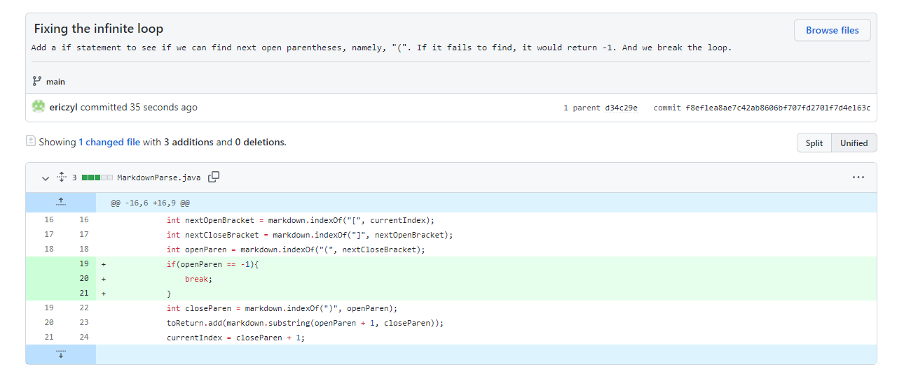
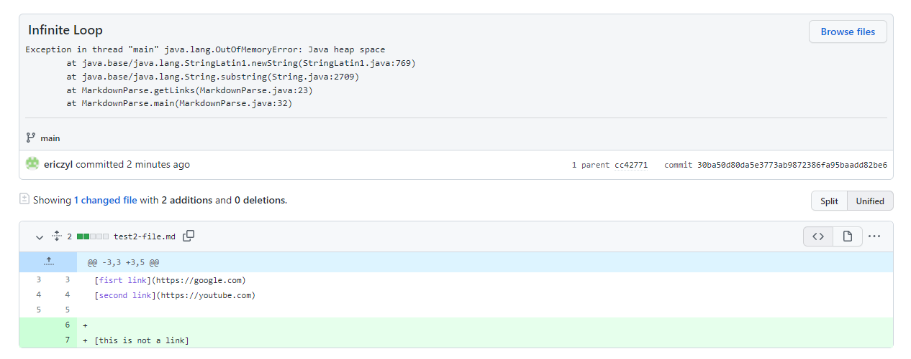
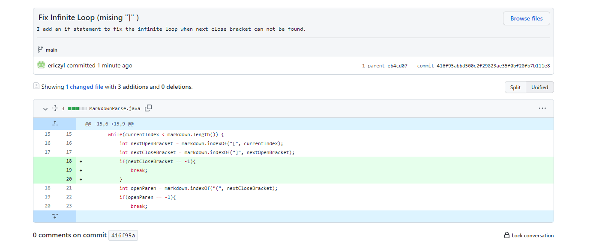
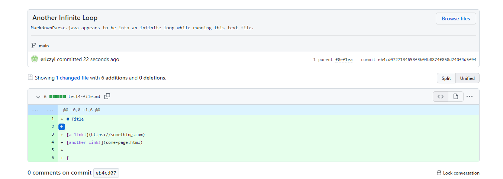
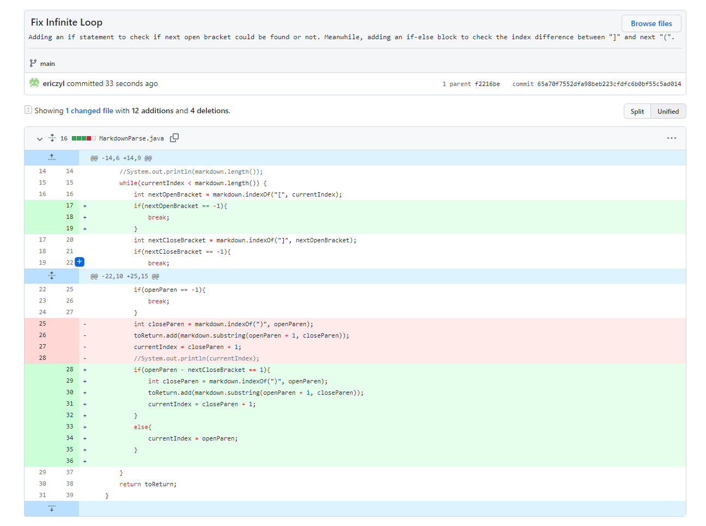
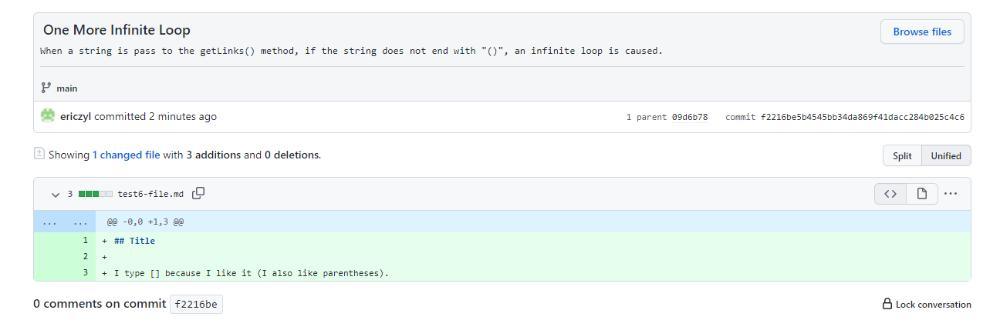
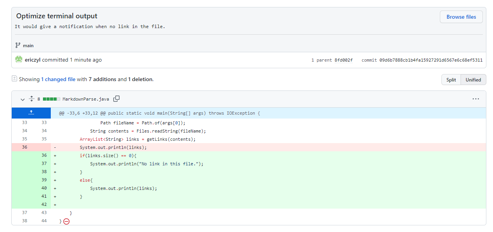
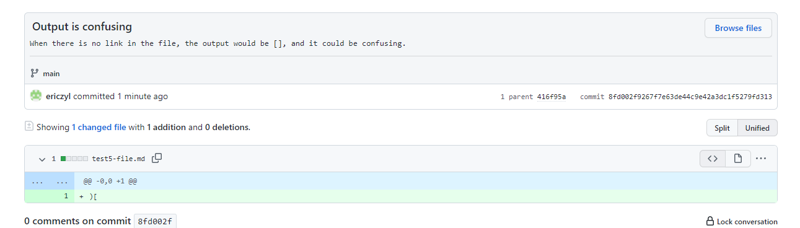

# Lab 2: Incremental Programming and Debugging
In this lab, I create several test-files to test if ```MarkdownParse.java``` functions properly or not. I try to write edge cases to see if the program throw any errors or not. And I fix it incrementally in aid of GitHub.
<br/><br/>

## Code Change 1:

### Fixing the bug:
<br/>

### Link to the failure inducing test file: 
[test2-file](test2-file.md)


<br/>

### Symptom of that failure-inducing input: 
At the command line, it shows following exception. 
```
Exception in thread "main" java.lang.OutOfMemoryError: Java heap space
        at java.base/java.lang.StringLatin1.newString(StringLatin1.java:769)
        at java.base/java.lang.String.substring(String.java:2709)
        at MarkdownParse.getLinks(MarkdownParse.java:23)
        at MarkdownParse.main(MarkdownParse.java:32)
```
<br/>

### Description: 
This bug is induced by an infinite loop. The while loop in ```MarkdownParse.java``` would not end the loop if it fails to find a "(" after an ending bracket "]". And thus, it cause a exception in ```java.lang.OutOfMemoryError```. It is fixed by adding a if statement which enables it to break the loop if no such parenthese is found. To be exact, when the ```indexOf``` method fails to find "(", it woul return -1, and it is caught by the if statement.
<br/><br/><br/><br/>


## Code Change 2:

### Fixing the bug:

<br/>

### Link to the failure inducing test file: 
[test4-file](test4-file.md)

Following is a picture from github repo history. It indicates such file edit causes a bug. 


<br/>

### Symptom of that failure-inducing input: 
At the command line, it shows following exception.
```
PS E:\2022winter\CSE15L\markdown-parse> javac MarkdownParse.java        
PS E:\2022winter\CSE15L\markdown-parse> java MarkdownParse test4-file.md
Exception in thread "main" java.lang.OutOfMemoryError: Java heap space
        at java.base/java.lang.StringLatin1.newString(StringLatin1.java:769)
        at java.base/java.lang.String.substring(String.java:2709)
        at MarkdownParse.getLinks(MarkdownParse.java:23)
        at MarkdownParse.main(MarkdownParse.java:32)
```
<br/>

### Description: 
I think the original code would function properly when it contains exactly "()[]". This is because the index of left parenthese is decided by the index of previous close bracket. And the index of close bracket is determined by the index of previous open bracket. And at the situation that "]" or "(" is missing, it would return -1, and thus it fall into an infinite loop. Consequently, it leads to a symptom of ```java.lang.OutOfMemoryError```. 
<br/><br/><br/><br/>

## Code Change 3:

### Fixing the bug:


<br/>

### Link to the failure inducing test file: 
[test6-file](test6-file.md)

Following is a picture from github repo history, and it shows that if the file does not end with "()", it would again causes an infinite loop.


<br/>

### Symptom observed from the terminal:
```
PS E:\2022winter\CSE15L\markdown-parse> javac MarkdownParse.java        
PS E:\2022winter\CSE15L\markdown-parse> java MarkdownParse test6-file.md
Exception in thread "main" java.lang.OutOfMemoryError: Java heap space
        at java.base/java.lang.StringLatin1.newString(StringLatin1.java:769)
        at java.base/java.lang.String.substring(String.java:2709)
        at MarkdownParse.getLinks(MarkdownParse.java:26)
        at MarkdownParse.main(MarkdownParse.java:37)
```
<br/>

### Examine the bug:
I added two print statement to print out the value of current index in the end of the loop as well as the length of the string that is passed to the method. See the following screenshot.
```
System.out.println(currentIndex);
System.out.println(markdown.length());
break;
```
And terminal print the following:
```
PS E:\2022winter\CSE15L\markdown-parse> javac MarkdownParse.java        
PS E:\2022winter\CSE15L\markdown-parse> java MarkdownParse test6-file.md
65
66
[I also like parentheses]
```
Adding an if statement to fix the case when current index is smaller than string's length and no open parenthese is found could fix the infinite loop. But it wont give right output: the stuff inside the parentheses is not even a link. 
```
PS E:\2022winter\CSE15L\markdown-parse> javac MarkdownParse.java        
[I also like parentheses]
```
And it is later fixed by adding an if-else block to check the index between close bracket and next open parenthese. If there is any space between these two characters, the contents inside of the parentheses should be ignored.
```
if(openParen - nextCloseBracket == 1){
    int closeParen = markdown.indexOf(")", openParen);
    toReturn.add(markdown.substring(openParen + 1, closeParen));
    currentIndex = closeParen + 1;
    }
    else{
        currentIndex = openParen;
    }
```
<br/>

### Description: 
Two bugs are found by running ```test6-file.md```. The first one is an infinite loop when the open bracket can not be found. And the sympton is also ```java.lang.OutOfMemoryError```. And it is fixed with a if statement to check the index of next open bracket. The sympton of the second bug is printing content in parentheses when the content is not a link at all. This bug is caused because the method does not check the spaces or charcters between the index of close bracket and the next open parenthese.
<br/><br/><br/><br/>

## Code Change 4:
This trial optimize output statement.


<br/>

### Link to the test file: 
[test5-file](test5-file.md)

Following is a picture from github repo history.

<br/>

### Symptom observed from the terminal:
```
PS E:\2022winter\CSE15L\markdown-parse> javac MarkdownParse.java        
PS E:\2022winter\CSE15L\markdown-parse> java MarkdownParse test5-file.md
[]
```
<br/>

### Description: 
The symptom is the inappropriate printing message in the terminal. And it is fixed with an if-else block to cover the situation when the size of the arraylist is 0. 