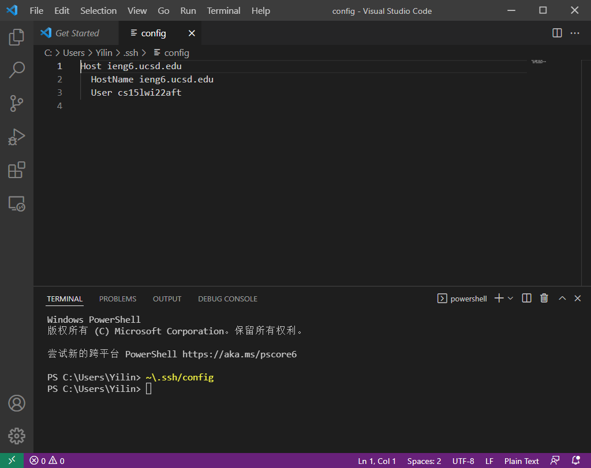
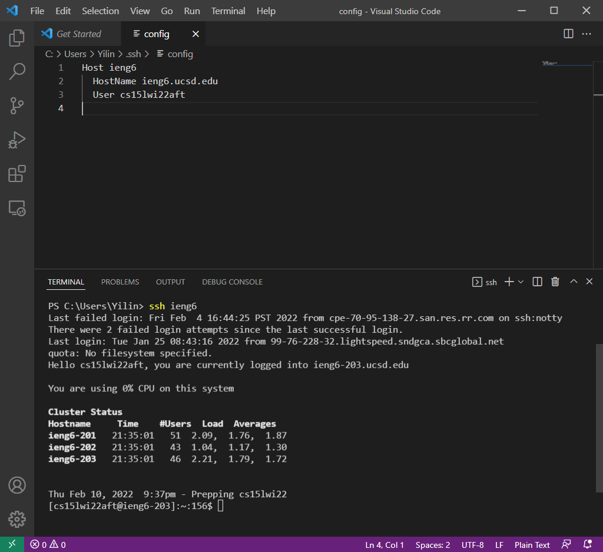
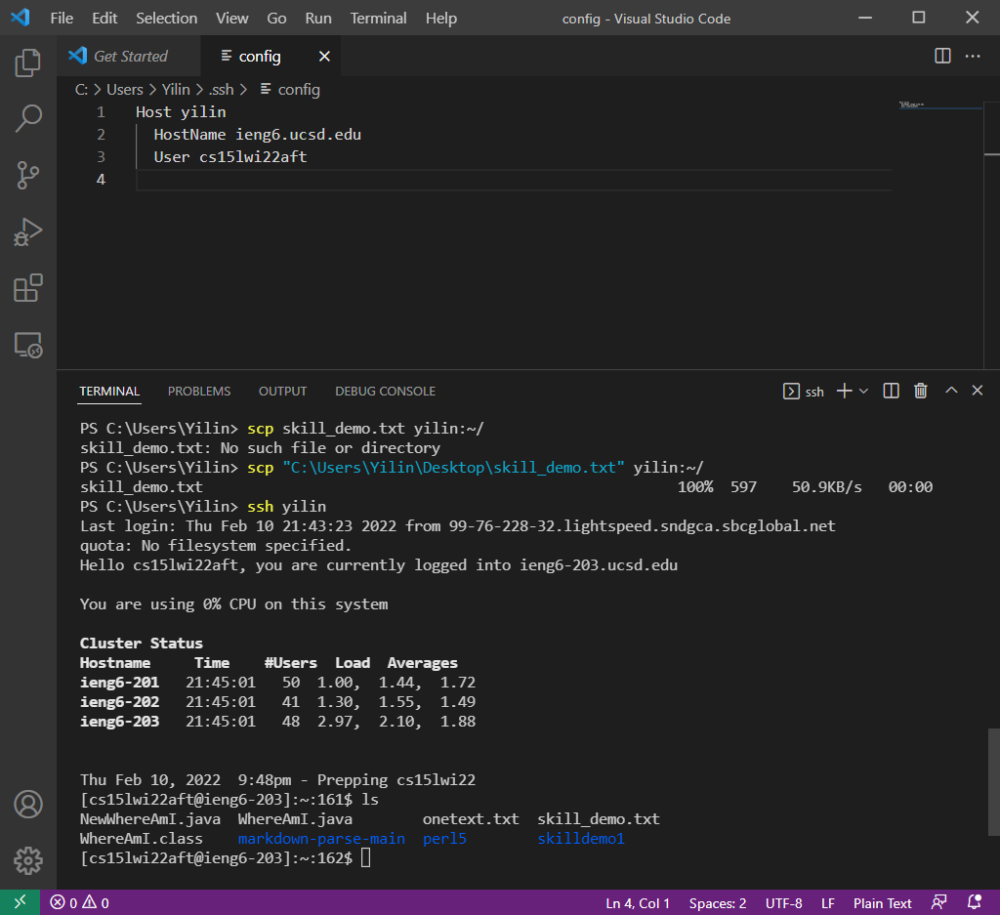

# Lab 3: Streamlining ssh Configuration
In this lab, I changed my ssh username from ieng6.ucsd.edu to my nickname yilin.

## Step1: Open Configuration File
I entered `~\.ssh/config` in my vscode terminal to open the file configuration file. I stored my ssh login key in disk C and the configuration file is in the same folder, so it is opened directly.



After that, I changed the first line of the config file to `ieng6`

I tried `ssh ieng6` in my terminal, and it did successfully login.


<br/><br/>


## Step 2: Change Username and Copy Files
I changed my ssh username to yilin by editing the first line of configuration file as shown below. Then I used the command code ```scp "C:\Users\Yilin\Desktop\skill_demo.txt" yilin:~/``` to copy the skill demo text file to my ieng6 account. After this, I used `ssh yilin` which is my new username to login and check the file. Entering command `ls`, I can see that the `skill_demo.txt` is successfully uploaded.


