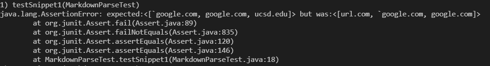
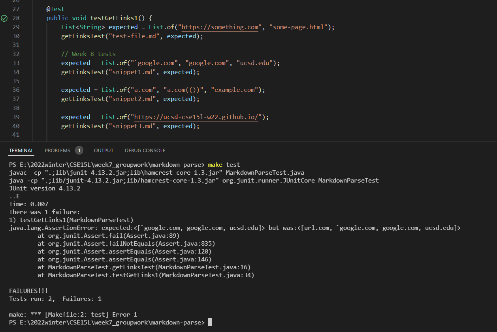
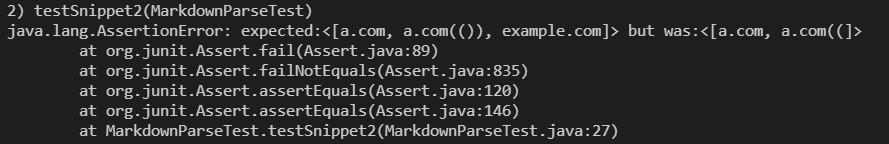
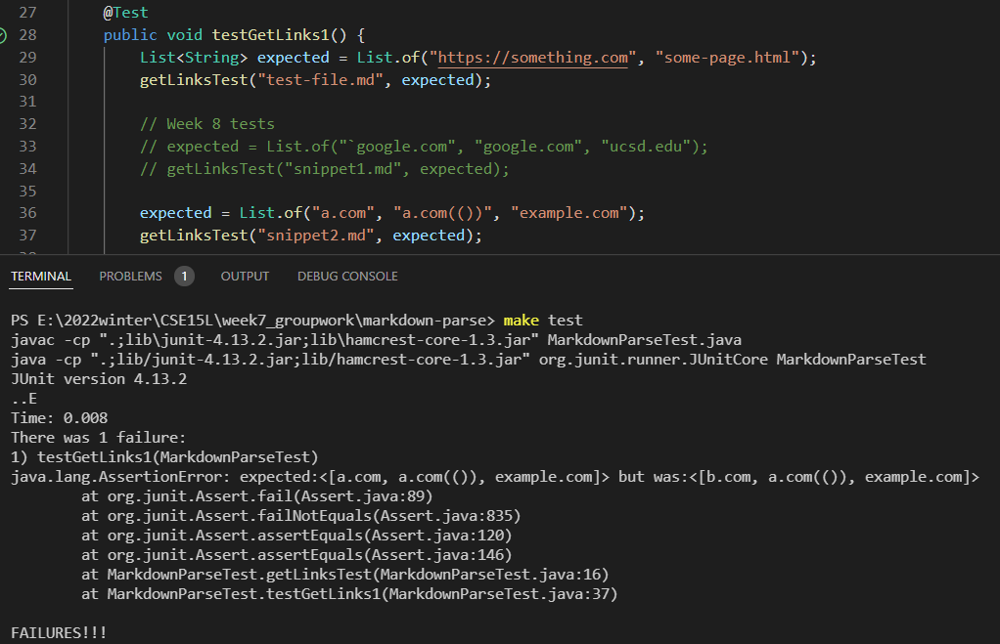
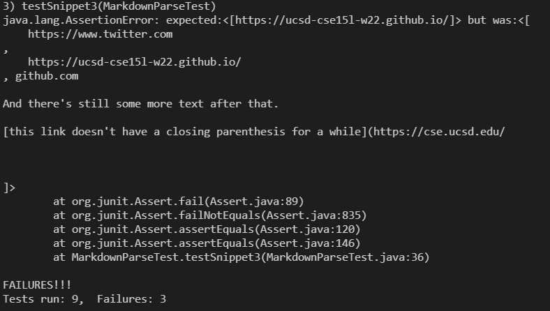
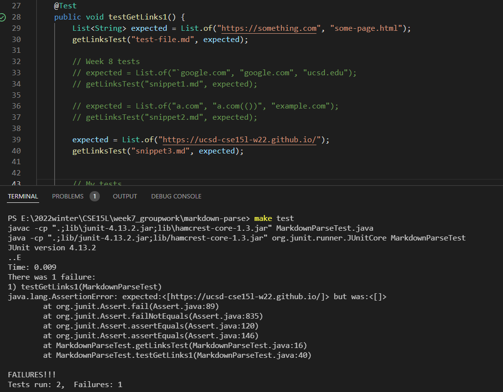

# Lab Report 4: More Tests for MarkdownParse
In this lab, I examine my MarkdownParse file and my peer's file with the given test cases.

[my repo](https://github.com/ericzyl/markdown-parse) <br/> [peer's repo](https://github.com/atruong39/markdown-parse)

## Snippet 1
```
`[a link`](url.com)

[another link](`google.com)`

[`cod[e`](google.com)

[`code]`](ucsd.edu)
```
According to the mark demo site, the expected output would be: [`google.com, google.com, ucsd.edu]

Here is the my new test:

```
@Test
public void testSnippet1() throws IOException{
    String filename = "snippet1.md";
    Path path = Paths.get(filename);
    String contents = Files.readString(path);
    List<String> expected = List.of("`google.com", "google.com", "ucsd.edu");
    assertEquals(expected, MarkdownParse.getLinks(contents));
}
```
**My MarkdownParse** did not pass the test.



My peer had a different implementation of the tester class, so I added following test.
```
expected = List.of("`google.com", "google.com", "ucsd.edu");
getLinksTest("snippet1.md", expected);
```
**My peer's code** fails this test case.

 **Output of running for my peer's implementation:**



My peer's count `url.com` as a valid link. But it should not be included since a part of it is inside a inline code block. 

**Note** that my peer includes multiple tests cases inside one test. So I just follow his/her
implementation to write three tests for three snippets. And here is a helper method he/she writes.

```
public static void getLinksTest(String filename, List<String> expected) {
    try {
        assertEquals(expected, MarkdownParse.getLinks(Files.readString(Path.of(filename))));
        } catch (Exception e) {
            System.out.println(e.toString());
    }
}
```

I think my program would need an involved change mainly because I did not consider the inline code blocks when I was testing the program. In the beginning, I think it could be fixed by locating the position of a pair of back sticks: if it is found, then we can jump to the index of next open bracket, and we break the loop if such index is -1. However, when I was writing that code, I found that I also need to consider the cases when back sticks are inside the bracket and parentheses, which makes it more complicated. Also, I believe there would be more bugs when we include a code block with six back sticks.
<br/><br/>


## Snippet 2
```
[a [nested link](a.com)](b.com)

[a nested parenthesized url](a.com(()))

[some escaped \[ brackets \]](example.com)
```
Expected output: `[a.com, a.com(()), example.com]`

My test in `MarkdownParseTest.java`:
```
@Test
public void testSnippet2() throws IOException{
    String filename = "snippet2.md";
    Path path = Paths.get(filename);
    String contents = Files.readString(path);
    List<String> expected = List.of("a.com", "a.com(())", "example.com");
    assertEquals(expected, MarkdownParse.getLinks(contents));
}
```
Again, **My MarkdownParse** does not pass the test, and here is the junit result.



Added test in my peer's tester class.
```
expected = List.of("a.com", "a.com(())", "example.com");
getLinksTest("snippet2.md", expected);
```
My peer's program does not pass the test. To be specific, `b.com` should not be printed, and the nested link `a.com` should be included.

Since my peer include several cases inside one test, I just comment out the first one so that I could see the result of testing snippet2.

 **Output of running for my peer's implementation:**



Comapring the actual ouput to the expected one, the first website seems correct. However, when I examine the code carefully, I feel it is just a coincidence because when my program locate the position of `nextCloseBracket`, it immediately tries to locate next open parenthesis and check if the distance between these two indices were 1. And it is true in the first line of snippet 2.

Running this test, I find that there are a lot of cases concerning parentheses that my program fail to include. Apprently, simply checking positions of parentheses with if-else or while would miss a lot of cases. For example, in the third line of snippet 2, it has many close parentheses. If I do not delete my original code and rewrite it, I need to keep track of both open bracket and close parenthesis. But I don't know how to achieve it with if-else statements. Hence, it requires more code.

The total number of lines in my peer's getLinks is 7. I guess one way to fix it would be following my peer's solution which includes usage of `Matcher` and  `Pattern`.
<br/><br/>


## Snippet 3
```
[this title text is really long and takes up more than 
one line

and has some line breaks](
    https://www.twitter.com
)

[this title text is really long and takes up more than 
one line](
    https://ucsd-cse15l-w22.github.io/
)


[this link doesn't have a closing parenthesis](github.com

And there's still some more text after that.

[this link doesn't have a closing parenthesis for a while](https://cse.ucsd.edu/


)

And then there's more text
```
According to the mark demo site, the expected output would be: `[https://ucsd-cse15l-w22.github.io]`

Here is the my new test:

```
@Test
public void testSnippet3() throws IOException{
    String filename = "snippet3.md";
    Path path = Paths.get(filename);
    String contents = Files.readString(path);
    List<String> expected = List.of("https://ucsd-cse15l-w22.github.io/");
    assertEquals(expected, MarkdownParse.getLinks(contents));
}
```
**My MarkdownParse** did not pass the test.



The test in my peer's file:
```
expected = List.of("https://ucsd-cse15l-w22.github.io");
getLinksTest("snippet3.md", expected);
```
**My peer's code** does not passed this test case either.

**Output of running for my peer's implementation:**



According to the CommonMark demo site, the cs315l website should be printed. But it acutal output is empty. 

I believe there is a quick fix that makes it work for snippet 3 and my other tests. The primary reason for printing weird stuff is that I did not consider the spaces inside a pair of parentheses. To fix that, I can add one more condition in my if statement for locating the position of next close parenthesis to check if there are spaces in it. If there is, then I set current index to the next available close bracket.
<br/><br/>