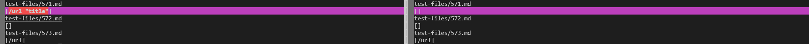

# Lab Report 5

## Finding the tests with different results
I used a bash for loop to forward results to a text file. And I did it for both my mardown-parse and the file provided by the professor.<br/>
Here is the code in the bash file.
```
for file in test-files/*.md;
do
  echo $file
  java MarkdownParse $file
done
```
Noted that I added `echo &file` to print the file name. In this way, I would be able to see which file causes different output. And I used `bash script.sh > results.txt` to write the result to text files.<br/>
After that, I used `vimdiff` to see the differences between these two text files. Here is a screenshot of it.


With the aid of `vimdiff`, I could compare two results easily.
<br/><br/>

## Comparing outputs
I actually saw many differences, so I would just randomly pick 2 to do an analysis.

### 1: file `571.md` <br/>
Here are the contents in the markdown file.
```

```
Here is a screenshot of comparison.



In `571.md`, my markdown prints `[/url "title"]`. But the given file prints `[]`.

The **expected output** should be an empty arraylist because the markdown file contains an image rather than a pure link.

So based on this observation, my professor's implementation gives correct output.

**Bug Description:**
Here is a snippet in my code that should be fixed.
```
int nextOpenBracket = markdown.indexOf("[", currentIndex);
    if(nextOpenBracket == -1){
        break;
    }
```
I do not check if there is an `!` before the open bracket. So my code treats `` as a link rather than a picture. I believe a quick fix would be adding one more condition to check if there is an exclamation mark before `[`.

It seems that the code given by my professor return the correct output. But when I looked at the code, I felt it more likely to be an coincidence. The following is the code that accidentally gives "correct" output in professor's file.
```
String potentialLink = markdown.substring(openParen + 1, closeParen).trim();
    if(potentialLink.indexOf(" ") == -1 && potentialLink.indexOf("\n") == -1) {
        toReturn.add(potentialLink);
        currentIndex = closeParen + 1;
    }
    else{
        currentIndex = currentIndex + 1;
    }
```
It puts the contents between open parenthesis and close parenthesis into a String called `potentialLink`. And it checks if there is a space or a nextline inside the parentheses. If there is, then it would just ignores this pair parentheses. Accidentally, there is a space right after `/url`, and this leads the file to ignore the "link". In general, it doesn't check if it is a picture or not.
<br/><br/>

### 2: file `201.md` <br/>
Here are the contents in the markdown file.
```
[foo]: <bar>(baz)

[foo]
```
Here is a screenshot of a comparison.


In `201.md`, my file prints `[]`. But the given parse file prints `[baz]`.

I put the contents in common markdown website, and it shows the following.
```
[foo]: (baz)

[foo]
```
It means the **expected output** should be empty since there isn't any links in the markdown file.<br/>
Thus, my `MarkdownParse.java` gives the correct ouput.<br/>

**Bug Description:**
In the code provided by professor, there is a `findCloseParen` method which helps to find correct position of close parenthesis in the case that there are multiple pairs of parentheses. An here is the code that should be fixed.
```
int nextCloseBracket = markdown.indexOf("]", nextOpenBracket);
    int openParen = markdown.indexOf("(", nextCloseBracket);

    // The close paren we need may not be the next one in the file
int closeParen = findCloseParen(markdown, openParen);
            
    if(nextOpenBracket == -1 || nextCloseBracket == -1
          || closeParen == -1 || openParen == -1) {
        return toReturn;
    }
    String potentialLink = markdown.substring(openParen + 1, closeParen).trim();
```
Noted that in `201.md`, there are contents between `]` and `(`, which makes the "link" invalid. However, the code above did not check if the close bracket and the next open parenthesis are sticking together. It simply check if there is a pair of brackets and parentheses. If yes, then it just print the contents inside the parentheses. And this lead to an error output in this test case.

